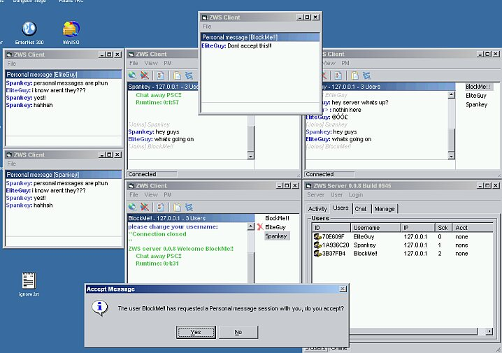



## ZWS Multiuser chat update

### Description

Advanced Multiuser chat client/server system, now with personal(instant) messages, blocking, and syntax highlighting(colors). there are still a lot of bugs, but im working them out.. server is stable. server features include, login security system, user restrictions, kick. Come and chat with the rest of PSC on my server!
 
### More Info
 

             |
---                |---
**Submitted On**   |2002-04-05 22:04:24
**By**             |[EliteGuy](https://github.com/Planet-Source-Code/PSCIndex/blob/master/ByAuthor/eliteguy.md)
**Level**          |Intermediate
**User Rating**    |4.7 (61 globes from 13 users)
**Compatibility**  |VB 6\.0
**Category**       |[Internet/ HTML](https://github.com/Planet-Source-Code/PSCIndex/blob/master/ByCategory/internet-html__1-34.md)
**World**          |[Visual Basic](https://github.com/Planet-Source-Code/PSCIndex/blob/master/ByWorld/visual-basic.md)
**Archive File**   |[ZWS\_Multiu69237452002\.zip](https://github.com/Planet-Source-Code/eliteguy-zws-multiuser-chat-update__1-33485/archive/master.zip)

